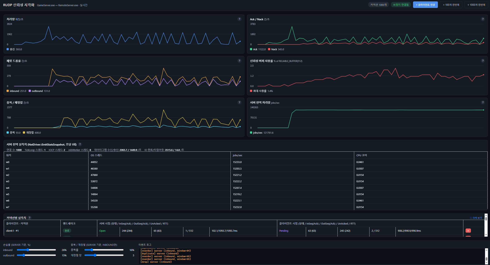
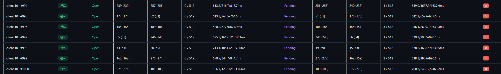
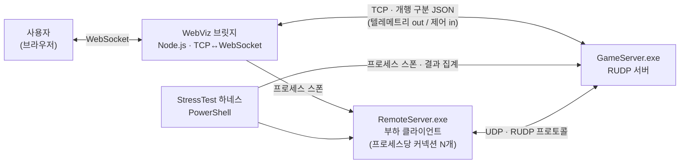
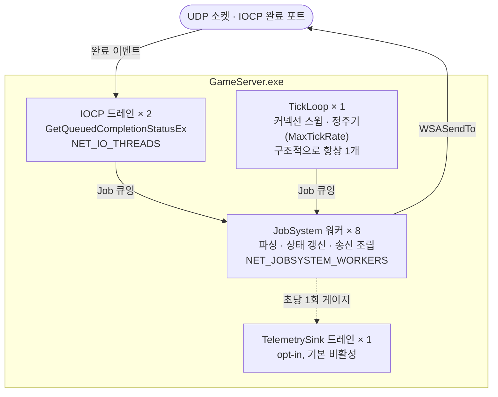
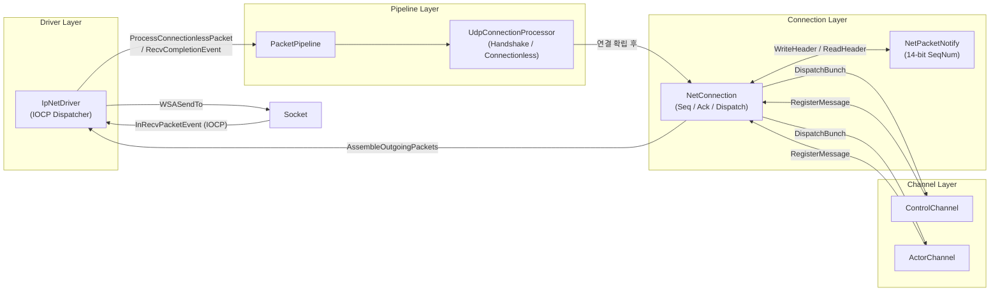

# Toska — C++20 멀티 스레드 RUDP 엔진

> UE5 네트워크 레이어를 C++20·IOCP로 재구현하고, Ack/Nack 재전송이 손실을 복구하는 과정을 브라우저에서 실시간으로 보여주는 멀티스레드 RUDP 엔진

| | |
|---|---|
| **기간 · 인원** | 2025.04 ~ 2026.09 · 개인 프로젝트 (설계 · 구현 · 검증 전 범위) |
| **규모** | 16,480 LOC / 188 files (생성 코드 제외) |
| **핵심 성과** | 동시 커넥션 **1,000개** · 크래시 재현율 **35% → 0%** · Handshake 성공률 **54.2% → 99.2%** · CPU **86배 절감** |

### 기술 스택

| 구분 | 사용 기술 |
|---|---|
| **언어 · 표준** | C++20 (코루틴, `std::atomic`, 템플릿) |
| **비동기 I/O** | Windows IOCP — `GetQueuedCompletionStatusEx` 배치 처리 |
| **동시성** | 자체 포팅 `JobSystem` · lock-free 큐 · 커넥션-워커 고정 |
| **네트워크** | 자체 RUDP — 14bit 시퀀스(wrap-around), 256bit Selective Ack, Nack 기반 재전송 |
| **직렬화** | Protocol Buffers 3.21 · 자체 `BitReader`/`BitWriter`(비트 단위 패킹) |
| **보안** | Crypto++ — HMAC 기반 핸드셰이크 쿠키 (IP 스푸핑 방어) |
| **빌드** | MSVC / Visual Studio 2022 · MSBuild · vcpkg 매니페스트 모드 |
| **로깅 · 설정** | spdlog(비동기) · fmt · nlohmann/json |
| **테스트 자동화** | PowerShell 부하 스트레스 — 반복 실행 · 중앙값 집계 · CSV 출력 |
| **관측 · 디버깅** | 자체 상태 전송(TCP/JSON) · WinDbg(cdb) 사후 attach |
| **시각화** | Node.js WebSocket 브릿지 · 바닐라 JS + Canvas |

### 측정 결과

| 지표 | 결과 |
|---|---|
| 동시 커넥션 | **1,000개** 처리 |
| 크래시 재현율 | 35% → **0%** (60회 시도) |
| Handshake 성공률 | 54.2% → **99.2%** |
| CPU 사용률 | 197.9% → **2.3%** (약 86배) |
| 부하 생성 비용 | CPU **11.2배** / 메모리 **27.6배** 절감 |
| 장애 피해 반경 | 125커넥션 → **1커넥션** |

모든 수치는 반복 실행 후 중앙값입니다. 측정 방법과 원본 기록은
[`docs/problem-solving.md`](docs/problem-solving.md)에 있습니다.

---

## 스크린샷

<p align="center"></p>
<p align="center"><sub>메인 대시보드 — 커넥션 1000개, 손실률을 실시간으로 올린 상태</sub></p>

<p align="center"></p>
<p align="center"><sub>커넥션별 측정치 "크게 보기" — 1000개 커넥션 각각의 상태·시퀀스·RTT</sub></p>

---

## 데모 영상

실제 `GameServer.exe`/`RemoteServer.exe`를 띄운 채, 손실률을 실시간으로 올려 Nack 기반 재전송이 동작하는 걸 WebViz 화면에서 시연한 영상입니다.

[](https://github.com/cinderbird/rudp-network-engine/blob/main/docs/assets/web_rudp_run.mp4)

*(위 썸네일을 클릭하면 GitHub 페이지에서 영상이 재생됩니다. 안 뜨면 [`docs/assets/web_rudp_run.mp4`](docs/assets/web_rudp_run.mp4) 링크로 직접 여세요.)*

---

## Quick Start — 빌드 및 실행 방법

```powershell
git clone <이 저장소 URL>
cd UE-RUDP-GameServer-main
bootstrap.bat                          # 레포 로컬 vcpkg를 1회 준비 (git, 인터넷 필요)
# Toska.sln을 Visual Studio 2022로 열고 Release|x64로 빌드
#   (또는 커맨드라인: msbuild Toska.sln /p:Configuration=Release /p:Platform=x64)
cd Programs\WebViz
npm install
npm start                              # http://localhost:8090 에서 GameServer.exe를 자동으로 함께 띄움
```

Ack/Nack·RTT·워커별 부하를 실시간으로 갱신되는 걸 확인할 수 있습니다. 
---

## 목차

### 문서 전체 — 읽는 순서

모든 문서 상단에 같은 이동 줄이 붙어 있어, 어디로 들어가든 목차로 돌아올 수 있습니다.

| # | 문서 | 답하는 질문 | 
|---|---|---|
| 1 | **[문제 해결 과정](docs/problem-solving.md)** | 문제를 **어떻게 알아내고 풀었는가** |
| 2 | **[설계 결정 5건](docs/decisions/README.md)** | 엔진 설계에서 **왜 이 선택인가, 무엇을 감수했는가** |
| 3 | [엔진 설계](docs/reference/engine-design.md) | 지금 코드가 어떻게 동작하는가 |
| 4 | [아키텍처](docs/reference/architecture.md) | 핸드셰이크·송수신 경로의 정확한 흐름 |
| 5 | [시퀀스 번호](docs/reference/sequence.md) | 14비트 산술과 Ack/Nack 처리 |
| 6 | [WebViz 실행](docs/web-visualization.md) | 시각화 도구를 어떻게 돌리는가 |

문서의 역할 구분과 디렉터리 구조는 [`docs/README.md`](docs/README.md)에 있습니다.

<details>
<summary><b>설계 결정 5건 펼쳐보기</b> — 엔진 설계에 대하여 근거와 판단을 정리한 문서들입니다.</summary>

| # | 결정 | 
|---|---|
| [0001](docs/decisions/0001-connection-worker-pinning.md) | 커넥션을 JobSystem 워커에 핀 고정한다 |
| [0002](docs/decisions/0002-cv-wait-scheduler.md) | 워커 대기 방식으로 CV-wait을 채택한다 | 
| [0003](docs/decisions/0003-telemetry-opt-in.md) | 서버 상태 전달은 opt-in + 매크로 게이트 | 
| [0004](docs/decisions/0004-tick-io-separation.md) | 소켓 완료 꺼내기(GetQueuedCompletionStatus)와 커넥션 관리를 분리한다 | 
| [0005](docs/decisions/0005-multi-connection-load-generator.md) | 부하 생성기를 프로세스당 N 커넥션으로 | 

</details>

### 이 문서

[프로젝트 개요](#프로젝트-개요) · [전체 아키텍처](#전체-아키텍처) · [모듈별 설명](#모듈별-설명) · [빌드 환경](#빌드-환경) · [더 읽을거리](#더-읽을거리)

---

## 프로젝트 개요

| 항목 | 내용 |
|------|------|
| 언어 | C++20 |
| 플랫폼 | Windows 10 (IOCP 기반) |
| 목적 | UE5 RUDP 파이프라인의 핵심 로직을 독립 C++ 서버 엔진으로 이식 |
| 신뢰성 방식 | RTO/타이머 기반 재전송이 아닌, UE5와 동일한 **Nack 기반 재전송 + Keepalive + 연결 레벨 타임아웃 + 채널별 버퍼 상한**의 조합 |

UE5는 `IpNetDriver` → `PacketHandler` → `NetConnection` → `NetChannel` 계층으로 네트워크 패킷을 처리합니다. 이 프로젝트는 그 계층 구조와 핸드셰이크 프로토콜, 시퀀스 번호 기반 신뢰성 시스템, 채널별 Bunch 조립/재조립 로직을 C++ 표준 라이브러리와 Windows IOCP 위에서 재현합니다. 스레딩 모델은 자체 포팅한 코루틴 지원 스케줄러(`JobSystem`) 위에서 커넥션별 스레드 핀 고정으로 동시성을 관리합니다.

---

## 전체 아키텍처

### 1단계 — 시스템 컨텍스트

<p align="center"></p>

<details>
<summary>다이어그램 소스 (mermaid)</summary>



</details>

### 2단계 — 프로세스 내부의 스레드 역할

<p align="center"></p>

<details>
<summary>다이어그램 소스 (mermaid)</summary>



</details>

**앞의 둘은 감지해서 Job으로 큐잉만 하고, 무거운 작업은 전부 워커가 합니다.** 각 커넥션은
워커 하나에 고정되며, 커넥션 내부 상태가 락 없이 동작합니다.
[결정-0001](docs/decisions/0001-connection-worker-pinning.md).

세 역할의 스레드 수는 `NET_IO_THREADS` · `NET_JOBSYSTEM_WORKERS` 환경변수로 재빌드 없이
바꿀 수 있습니다.

### 3단계 — 패킷 파이프라인

<p align="center"></p>

<details>
<summary>다이어그램 소스 (mermaid)</summary>



</details>

> 이 다이어그램은 **패킷 처리 로직의 흐름만** 보여줍니다. 실제 실행이 어느 스레드에서
> 일어나는지는 위 2단계 그림을 확인해주세요.

### 더 살펴보기 — 컴포넌트 수준

| 보고 싶은 것 | 문서 |
|---|---|
| 4단계 핸드셰이크 시퀀스, 수신/송신 경로, Bunch 조립 흐름 | [`docs/reference/architecture.md`](docs/reference/architecture.md) |
| 14비트 시퀀스 산술, 256비트 히스토리 비트셋, Ack/Nack 처리 | [`docs/reference/sequence.md`](docs/reference/sequence.md) |
| 계층별 전체 구조와 핵심 로직 | [`docs/reference/engine-design.md`](docs/reference/engine-design.md) |

---

## 모듈별 설명

### Network (핵심 모듈)

| 계층 | 역할 | 상세 문서 |
|------|------|------|
| **Driver** (`src/driver/`) | IOCP 기반 비동기 소켓 I/O, 연결별 `NetConnection` 생성, `TickDispatch`/`TickFlush`로 메인 루프 통합 | [ENGINE_DESIGN.md §6](docs/reference/engine-design.md#6-드라이버-계층-projectnetworksrcdriver) |
| **Processor / Pipeline** (`src/processor/`) | 3단계 핸드셰이크, CryptoPP 기반 쿠키 생성/검증, 재전송 타이머 | [ARCHITECTURE.md](docs/reference/architecture.md) |
| **Connection** (`src/connection/`) | 패킷 시퀀스 관리, 채널 생성, Ack/Nack 처리, Bunch 조립/분배, keepalive/타임아웃, 커넥션-스레드 핀 고정 | [ENGINE_DESIGN.md §2](docs/reference/engine-design.md#2-커넥션-계층-projectnetworksrcconnection) |
| **Channel** (`src/channel/`) | 채널별 독립 시퀀스, `RELIABLE_BUFFER` 상한, Bunch 재조립/재전송 큐 | [ENGINE_DESIGN.md §3](docs/reference/engine-design.md#3-채널-계층-projectnetworksrcchannel) |
| **Sequence & Reliability** (`src/sequence/`) | `TSequenceNumber`(14비트 wrap-around 산술), `TSequenceHistory`(256비트 선택적 Ack), `NetPacketNotify` | [SEQUENCE.md](docs/reference/sequence.md) |
| **Threading** (`src/thread/`) | `JobSystem`(코루틴 지원 lock-free 스케줄러), 커넥션별 워커 핀 고정, busy-spin/CV-wait 선택 가능한 idle 대기 | [ENGINE_DESIGN.md §5](docs/reference/engine-design.md#5-스레딩--projectnetworksrcthread) |
| **Simulation** (`src/simulation/`) | 양방향(recv/send) 패킷 드롭·중복·재정렬 시뮬레이터 — 테스트/검증용 | [ENGINE_DESIGN.md §7](docs/reference/engine-design.md#7-패킷-손실-시뮬레이터-projectnetworksrcsimulation) |

### GameServer / RemoteServer

`GameServer`는 `NetConnection` 위에서 동작하는 게임 레이어입니다 — `Room`/`Player` 관리, 로그인 검증, 프로토콜 핸들러 바인딩을 포함합니다. `RemoteServer`는 **테스트/부하 검증용 클라이언트**입니다 — 실제 게임 클라이언트가 아니라, `GameServer`와 동일한 네트워크 레이어를 공유하며 이 프로젝트의 모든 스트레스 테스트(핸드셰이크율, 신뢰성 검증)를 생성하는 도구입니다. 둘 다 자세한 내용은 [ENGINE_DESIGN.md §11](docs/reference/engine-design.md#11-게임-레이어-projectgameserver)에 있습니다.

### Core

`BitReader`/`BitWriter`(비트 단위 직렬화) 엔진 전반에서 쓰입니다. 자세한 내용은 [ENGINE_DESIGN.md §12](docs/reference/engine-design.md#12-core-라이브러리-projectcore)에 있습니다.

### WebViz — 신뢰성 메커니즘 실시간 시각화

`Programs/WebViz/`는 실제 `GameServer.exe`/`RemoteServer.exe`를 그대로 실행한 채, `Ack`/`Nack`/패킷 드롭/재전송이 벌어지는 과정을 브라우저에서 실시간으로 보여주는 도구입니다. 실시간 집계 차트(처리량/Ack·Nack/드롭율/신뢰성 버퍼 사용률)와 커넥션별 `InSeq`/`OutSeq`/`OutUnAckedBunches`을 보여줍니다. 손실률 슬라이더로 그 자리에서 손실을 주입하며 신뢰성 메커니즘이 실제로 복구하는 걸 볼 수 있습니다. 자세한 내용과 실행 방법은 [`docs/web-visualization.md`](docs/web-visualization.md)에 있습니다.

---

## 빌드 환경

| 항목 | 버전 / 설정 |
|------|------------|
| OS | Windows 10 Pro (x64) |
| 컴파일러 | MSVC (Visual Studio 2022) |
| C++ 표준 | C++20 |
| CRT | `/MD` (Release) / `/MDd` (Debug) — UE5 CRT 매칭 |
| Protobuf | v3.21.12 (vcpkg 관리, `overrides`로 버전 고정) |
| CryptoPP | vcpkg 관리 |
| fmt | vcpkg 관리 |
| spdlog | vcpkg 관리 |
| nlohmann-json | vcpkg 관리 |

### 사전 준비물 (클론 후 처음 빌드하는 경우)

1. **Visual Studio 2022** — "C++를 사용한 데스크톱 개발" 워크로드가 필요합니다.
   저장소 루트의 **`bootstrap.bat`을 한 번 실행**하면 vcpkg를 통해 필요한 라이브러리 설치를 진행합니다.
2. **Python 3** (PATH에 등록되어 `python` 명령으로 실행 가능해야 함) — `.proto` 코드 생성 스크립트([proto_generator.py](Programs/ProtoGenerator/scripts/proto_generator.py))가 빌드 전 이벤트로 자동 실행됩니다.
3. **Node.js** (LTS 권장) — 웹 시각화 도구(`Programs/WebViz/`)를 실행하려면 필요합니다. 엔진 자체 빌드에는 필요 없습니다.
4. 첫 빌드는 vcpkg가 의존 라이브러리를 소스에서 빌드하므로 다소 시간이 걸릴 수 있습니다.

### 빌드 주의 사항

- Protobuf 런타임 라이브러리는 vcpkg가 관리하며, `.proto` → `.pb.cc` / `.pb.h` 코드 생성에는 `Common/protoc-21.12-win64/`에 포함된 `protoc.exe`를 사용합니다.
- IOCP를 사용하므로 Windows 전용 빌드만 지원됩니다.

### 검증 도구

`Programs/StressTest/Run-ConnectionStressTest.ps1`이 이 프로젝트 전체의 검증 도구입니다 — `GameServer.exe`와 다수의 `RemoteServer.exe`를 띄워 핸드셰이크율, 크래시 유무, 신뢰성 지표(`OutUnAckedBunches`, RTT percentile 등)를 자동 집계합니다. 패킷 손실/중복/재정렬을 양방향으로 켤 수 있습니다(`-EnablePacketSim`). 이걸 감싼 스윕 스크립트가 세 개 더 있습니다 — `Run-SchedulerComparison.ps1`(busy-spin/CV-wait × 부하 × 반복), `Run-WorkerScaling.ps1`(JobSystem), `Run-IoThreadScaling.ps1` — 모두 반복 실행 후 중앙값과 CSV를 남깁니다.

---

## 더 읽을거리

문서는 역할별로 나뉘어 있습니다 — 전체 안내는 [`docs/README.md`](docs/README.md)에 있습니다.

**이해하기 — 왜 이렇게 되어 있는가**

- [`docs/problem-solving.md`](docs/problem-solving.md) — **문제 해결 과정.** 개발 중 마주친 문제들을 해결한 과정이 정리되어 있습니다.
  **이 프로젝트에서 가장 먼저 읽어볼 문서입니다.**
- [`docs/decisions/`](docs/decisions/README.md) — **설계 결정 기록 5건.** 테스트를 통해 확보한 데이터를 기준으로 아키텍처를 결정하였습니다.

**찾아보기 — 정확히 어떻게 동작하는가**

- [`docs/reference/engine-design.md`](docs/reference/engine-design.md) — 계층별 전체 구조와 핵심 로직.
- [`docs/reference/architecture.md`](docs/reference/architecture.md) — 핸드셰이크 상태머신, 4단계 시퀀스, 수신/송신 경로, Bunch 조립 흐름.
- [`docs/reference/sequence.md`](docs/reference/sequence.md) — 14비트 시퀀스 산술과 Ack/Nack 처리.

---

## 그 외 진행한 작업

| 프로젝트 | 구성 | 내용 |
|---|---|---|
| [**Tofu — UE5 내러티브 게임**](https://github.com/cinderbird/Tofu-UE5-Game) | 팀 4명 · **팀장** | UE 5.5 · GAS · CommonUI · GameFeatures. Lyra 샘플을 재구성해 시간·달력·선택을 축으로 설계. 단일 모듈 약 400개 C++ 파일, 자동화 테스트 97개.<br>**Jira** — 개발 현황을 빠르게 파악하고 이슈를 공유·전파·해결.<br>**Diversion** — Git은 바이너리 형상관리가 불편하고, 여러 명이 언리얼 에디터로 동시에 각자 파트를 작업하기 위해 채택. |
| [**TCP IOCP 게임 서버**](https://github.com/cinderbird/TcpIocp-GameServer) | 개인 · Git | C++20 코루틴 · concepts · barrier, Protocol Buffers, VTune 프로파일링. 직렬화 로직을 재사용해 언리얼 클라이언트와의 통신까지 확인.<br>**이 저장소의 `JobSystem`이 여기서 이식되었습니다.** |

앞선 두 작업의 결과물과 경험이 이 프로젝트로 모였습니다 — TCP 서버에서 만든 Task System이
`JobSystem`으로 이식됐고, UE5를 써 본 경험이 그 네트워크 레이어를 분석 대상으로 삼은
계기가 됐습니다.
