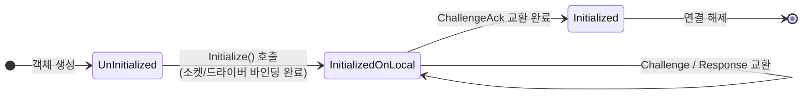
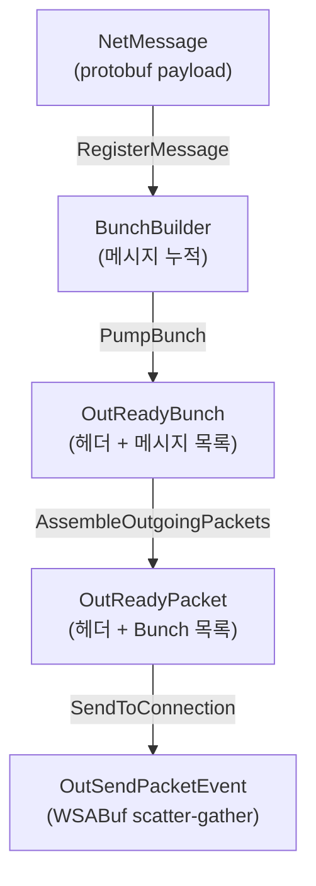
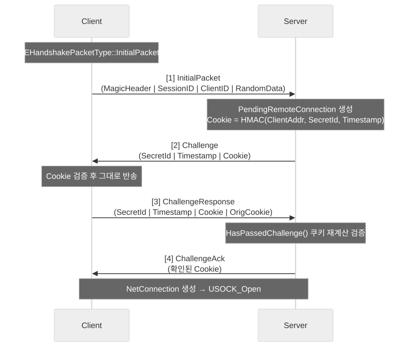
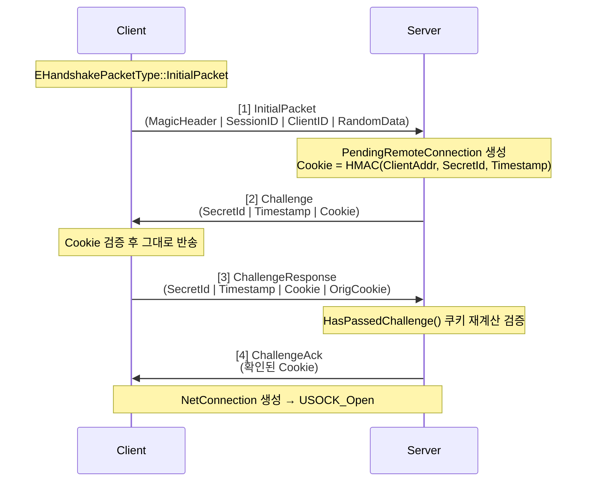

[문서 안내](../README.md) · [문제 해결 과정](../problem-solving.md) · [설계 결정](../decisions/README.md) · **레퍼런스** · [저장소 홈](../../README.md)

# UdpConnectionProcessor 아키텍처

`PacketPipeline` 내부에서 UDP 연결의 핸드셰이크와 패킷을 전담하는 컴포넌트입니다.

---

## 목차

1. [상태머신](#상태머신)
2. [패킷 처리 파이프라인](#패킷-처리-파이프라인)
3. [NetPacketNotify 시퀀스 번호 관리](#netpacketnotify-시퀀스-번호-관리)

---

## 상태머신

`PacketProcessor` 기반 클래스가 정의하는 `EProcessorState` 열거형으로 프로세서의 생명주기를 관리합니다.

<p align="center"></p>

<details>
<summary>다이어그램 소스 (mermaid)</summary>



</details>

### 각 상태 설명

| 상태 | 의미 | 진입 조건 |
|------|------|-----------|
| `UnInitialized` | 초기 상태. 소켓 미바인딩. | 객체 생성 시 |
| `InitializedOnLocal` | 로컬 측 초기화 완료. 핸드셰이크 가능 상태. | `Initialize()` 호출 후 |
| `Initialized` | 양방향 핸드셰이크 완료. 일반 패킷 송수신 가능. | `ChallengeAck` 교환 완료 |

> `InitializeOnRemote` 상태는 정의되어 있으나, UDP 핸드셰이크에서는 서버가 클라이언트의 `Response`를 확인하고 즉시 `Initialized`로 전환하는 구조이므로 현재 구현에서는 거쳐가지 않습니다.

---

## 패킷 처리 파이프라인

### 수신 경로

```
Socket IOCP 완료
    │
    ▼
IpNetDriver::RecvCompletionEvent()
    │  InRecvPacketEvent 생성 (주소 해시 포함)
    ▼
PacketPipeline::Incoming_Internal()
    │
    ├─ [연결 없음] → IncomingConnectionless()
    │       │
    │       ▼
    │   UdpConnectionProcessor::IncomingConnectionless()
    │       │  ParseHandshakePacket() 로 패킷 타입 판별
    │       │
    │       ├─ InitialPacket  → SendConnectChallenge()
    │       ├─ Response       → HasPassedChallenge() → SendChallengeAck()
    │       │                   → IpNetDriver::AddClient() → NetConnection 생성
    │       └─ RestartHandshake → 재연결 처리
    │
    └─ [연결 있음] → Incoming()
            │
            ▼
        UdpConnectionProcessor::Incoming()
            │  (현재 구현에서는 통과 후)
            ▼
        NetConnection::ReceivedRawPacket()
            │  BitReader 생성
            ▼
        NetConnection::ReceivedPacket()
            │  NetPacketNotify::ReadHeader() → Seq/Ack 파싱
            │  NetPacketNotify::Update()     → Ack/Nack 콜백 실행
            ▼
        NetConnection::DispatchPacket()
            │  Bunch 헤더 파싱 (ChIndex, ChSequence, bReliable …)
            ▼
        NetConnection::DispatchBunch()
            │  채널 룩업 또는 생성
            ▼
        NetChannel::DispatchRawBunch()
            │  순서 내 → 즉시 ReceivedMessage()
            └─ 순서 밖 → InUnreadBunchMap 에 보관 (재조립 대기)
```

### 송신 경로

메시지 하나가 소켓에 실리기까지 거치는 자료구조:

<p align="center"></p>

<details>
<summary>다이어그램 소스 (mermaid)</summary>



</details>

호출 순서는 다음과 같습니다.

```
NetChannel::RegisterMessage()
    │  NetMessage 를 BunchBuilder 에 추가
    ▼
NetChannel::PumpBunch()
    │  BunchHeader (ChIndex 4bit, ChSequence, bReliable …) 직렬화
    │  OutReadyBunch 생성
    ▼
NetConnection::AssembleOutgoingPackets()
    │  NetPacketNotify::WriteHeader() 로 패킷 헤더 직렬화
    │   └─ OutSeq(14bit) + InAckSeq(14bit) + HistoryWordCount + History(N×32bit)
    │  OutReadyPacket 에 Bunch 목록 추가
    ▼
IpNetDriver::SendToConnection()
    │  OutSendPacketEvent 생성 (WSABuf scatter-gather)
    ▼
WSASendTo() → IOCP 완료 이벤트 대기
    ▼
IpNetDriver::SendCompletionEvent() → 이벤트 반환
```

### 핸드셰이크 4단계 시퀀스

<p align="center"></p>

<details>
<summary>다이어그램 소스 (mermaid)</summary>



</details>

> pending 커넥션은 60개 버킷의 타임휠로 관리되며, 버킷 차례가 와도 최근 활동이 있으면
> 삭제되지 않는 **활동 기반 만료**입니다. 원래는 버킷 순번이 오면 무조건 스윕해 좀비
> 핸드셰이크를 만들었고(ISSUE-5), M18에서 활동 기반으로 재설계했습니다.

### 핸드셰이크 패킷 구조

`BeginHandshakePacket()` 이 생성하는 헤더 구조 (BitWriter 기반):

```
[ MagicHeader (1bit) | HandshakePacketType (3bit) | HandshakeTryCount (8bit)
| SessionID (2bit) | ClientID (3bit) | ... payload ... ]
```

쿠키 생성(`GenerateCookie`):

```
Cookie = CryptoPP::HMAC(
    key   = HandshakeSecret[SecretId],
    data  = ClientAddress || SecretId || Timestamp
)
```

`HasPassedChallenge()` 에서 수신된 쿠키를 재계산하여 비교함으로써 IP 스푸핑을 방어합니다.

### 재전송 타이머

`UdpConnectionProcessor::ResendHandshake()` 가 `Tick()` 마다 호출됩니다.

- `HandshakeResendInterval = 1.0f` 초마다 마지막으로 보낸 핸드셰이크 패킷을 재전송

---

## NetPacketNotify 시퀀스 번호 관리

`NetPacketNotify` 는 패킷 단위의 신뢰성을 구현하는 핵심 클래스입니다. `NetConnection` 이 소유하며, 모든 패킷 헤더 읽기/쓰기에 사용됩니다.

### 핵심 멤버 변수

| 멤버 | 의미 |
|------|------|
| `InSeq` | 내가 마지막으로 받은 상대방 패킷의 시퀀스 번호 |
| `InAckSeq` | 내가 마지막으로 Ack를 보낸 상대방의 패킷 시퀀스 번호. 상대방이 내 Ack를 받았는지는 미확인 |
| `InAckSeqAck` | 상대방이 내 Ack 수신을 확인한 마지막 상대방 패킷 시퀀스 번호 |
| `OutSeq` | 내가 마지막으로 보낸 패킷의 시퀀스 번호 |
| `OutAckSeq` | 내가 보낸 패킷 중 상대방이 Ack를 보내왔고, 내가 그 Ack를 수신한 마지막 시퀀스 번호 |
| `InSeqHistory` | 최근 수신한 패킷 256개의 도착 여부를 나타내는 비트셋 |
| `AckRecord` | `{OutSeq, InAckSeq}` 쌍의 덱. 내 패킷에 대한 Ack가 도달했을 때 어느 상대방 시퀀스까지 내가 확인했는지 역추적에 사용 |

### 14비트 Wrap-around와 256 히스토리 윈도우

```
SeqNumberBits = 14
SeqNumberCount = 2^14 = 16384   (유효 시퀀스 범위: 0 ~ 16383)
SeqNumberHalf  = 2^13 = 8192    (순환 비교의 기준점)

MaxSequenceHistoryLength = 256  (비트셋 슬롯 수)
```

한 번에 256개 패킷의 Ack/Nack 상태를 비트 1개로 표현합니다. 즉, 평균 RTT 내에 동시에 비행 중인 패킷 수가 256개 이하라면 완전한 Selective Ack 동작이 보장됩니다.

### 패킷 헤더 읽기/쓰기 흐름

```
WriteHeader(BitWriter&)
    OutSeq  → 14비트
    InAckSeq → 14비트
    HistoryWordCount → 가변 (SequenceHistory 크기를 얼마나 보낼지)
    InSeqHistory.Write() → HistoryWordCount × 32비트

ReadHeader(NotificationHeader&, BitReader&)
    NotificationHeader.Seq      ← 14비트
    NotificationHeader.AckedSeq ← 14비트
    NotificationHeader.HistoryWordCount ← 가변
    NotificationHeader.History.Read()  ← HistoryWordCount × 32비트
```

### Ack/Nack 처리 흐름

```
Update(NotificationData, Functor)
    │
    │  InSeqDelta = Diff(NotificationData.Seq, InSeq)
    │  InSeqDelta <= 0 → 중복/오래된 패킷, 무시
    │  InSeqDelta > 0  → 새 패킷
    │
    ├─ ProcessReceivedAcks(NotificationData, Functor)
    │       │
    │       │  AckCount = Diff(NotificationData.AckedSeq, OutAckSeq)
    │       │
    │       ├─ AckCount > 256 → 대규모 패킷 손실
    │       │   while AckCount > HistoryBits: Functor(seq, false=Nack)
    │       │
    │       └─ 정상 범위:
    │           while AckCount > 0:
    │               Functor(seq, History.IsDelivered(AckCount)) → Ack 또는 Nack
    │           OutAckSeq = NotificationData.AckedSeq
    │
    └─ InternalUpdate()
            InSeqHistory.AddDeliveryStatus(true) × InSeqDelta
            InSeq = NotificationData.Seq
            InAckSeq = max(InAckSeq, InSeq)
```

`Functor` 는 `NetConnection::RecivedAck` / `RecivedNack` 으로 바인딩되어, 해당 `PacketId` 를 담고 있는 `NetChannel` 의 `Acked()` / `Nacked()` 를 호출합니다. `Nacked()` 는 `OutUnAckedBunches` 에서 해당 Bunch를 꺼내 재전송 큐에 다시 삽입합니다.

---

← [엔진 설계](engine-design.md) · 다음 → [시퀀스 번호](sequence.md)
